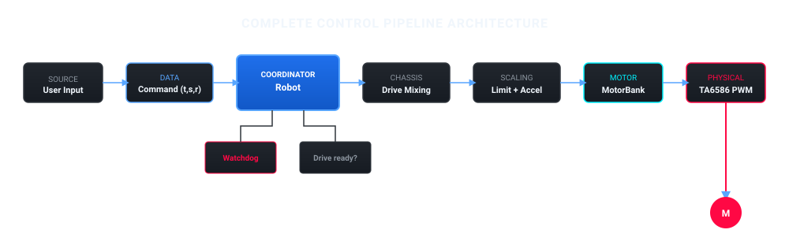
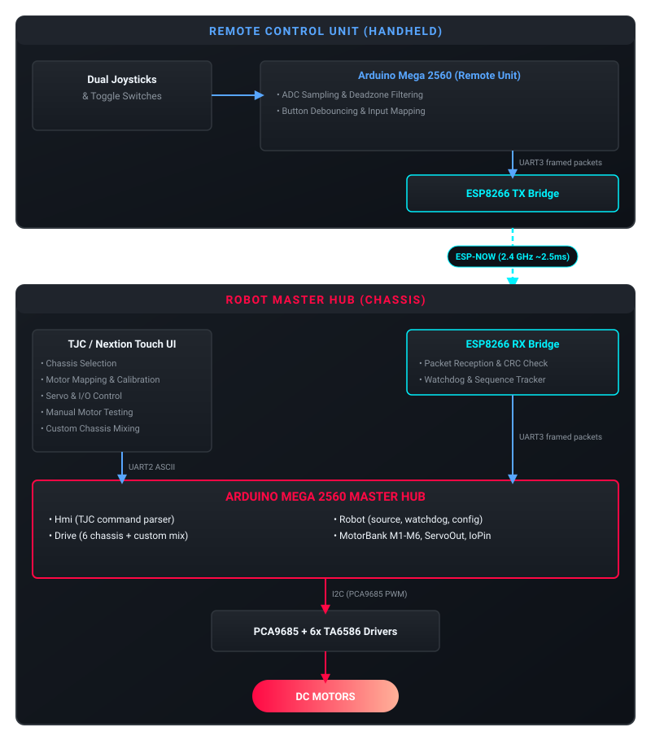

System Architecture & Design Philosophy
=======================================

System Overview
---------------
The firmware turns an Arduino Mega 2560 into a *plug, configure, play* robot controller. One firmware drives many chassis types; the TJC touchscreen chooses the chassis, maps motors to wheels, calibrates directions and saves the result to EEPROM. No rebuild is needed to change the robot.

The Mega:

* Drives two-wheel, tank, 4-wheel omni, mecanum, 6-wheel and custom chassis
* Runs six DC motors (M1 to M6) and up to sixteen servos through PCA9685 chips
* Exposes digital and analog pins as plain inputs or outputs
* Takes commands from the TJC touchscreen or from the ESP-NOW remote, both over UART
* Stops all motors when the command link is lost
* Stores the robot configuration in EEPROM

Layers
------

.. code-block:: text

   TJC touchscreen  <-- UART2 -->  Hmi            parse commands, answer, report configuration
                                    |
                                  Robot           choose control source, watchdog, own the configuration
                                    |
                                  Drive           chassis mixing, speed scaling, output limits
                                    |
                                  MotorBank       M0..M5: run (PWM), brake, stop
                                    |
                                  Pca9685         I2C PWM chip (0x40) + TA6586 motor drivers

   ESP-NOW remote   <-- UART3 -->  Robot           drive commands from the remote
   Servos                          ServoOut        PCA9685 chip 2 (0x41)
   Digital / analog pins           IoPin           in / out only

Each layer only knows the layer directly below it. The motor layer does not know what a wheel is, and ``Drive`` does not know which chip moves a motor.

Where the code lives
--------------------

.. list-table::
   :widths: 25 75
   :header-rows: 1

   * - Folder
     - Responsibility
   * - ``lib/Pca9685``
     - I2C PWM chip: set one channel duty cycle.
   * - ``lib/Motor``
     - ``IMotor`` (run, brake, stop), the TA6586 driver and ``MotorBank`` with six motors.
   * - ``lib/ServoOut``
     - Servo angle on a PCA9685 channel.
   * - ``lib/IoPin``
     - Configure a pin as input or output, read and write it.
   * - ``lib/Drive``
     - The six chassis presets, wheel mixing, PWM limit and acceleration limit.
   * - ``lib/RobotConfig``
     - One configuration structure with defaults, validation and EEPROM load and save.
   * - ``src/Robot_Mega2560``
     - ``Robot`` (glue), ``Hmi`` (TJC protocol) and ``setup()`` / ``loop()``.

Control Pipeline
----------------

System Architecture & Wireless Data Flow
----------------------------------------

Design Philosophy
-----------------

1. **Simple:**
   A newcomer should be able to read ``Robot_Mega2560.cpp`` and follow the whole system in a few minutes.

2. **Layered:**
   Motors only run, brake or stop. Servos only move to an angle. Pins are only inputs or outputs. Everything else is built on top.

3. **Configurable:**
   The touchscreen decides the chassis, the motor mapping and the limits. These are data in EEPROM, not code.

4. **Safe by default:**
   If the chassis is not fully mapped, or the command link is silent, the motors stay stopped.
